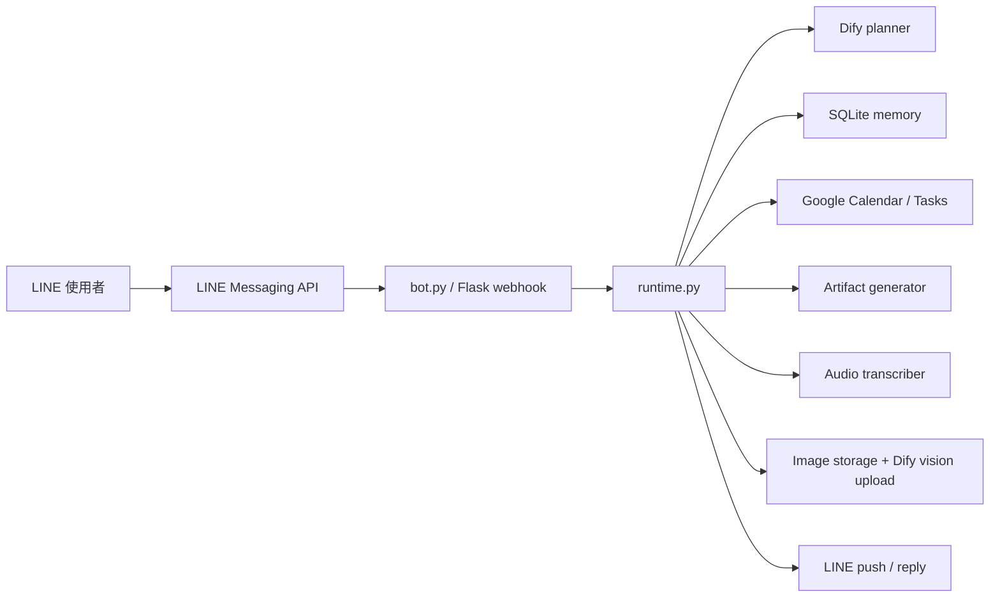
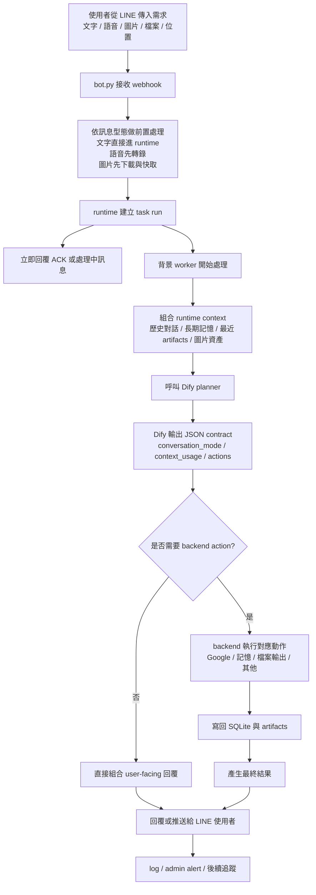
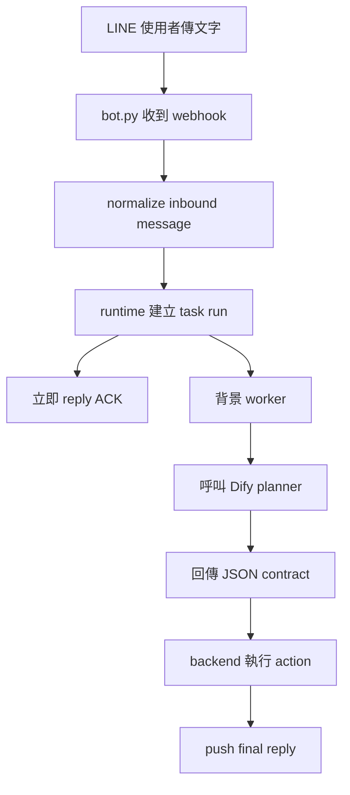
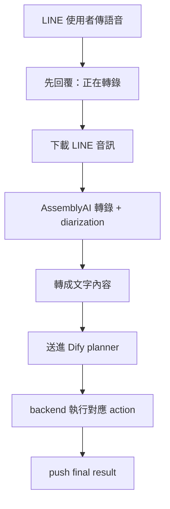
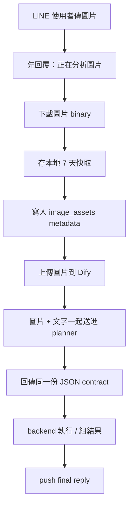
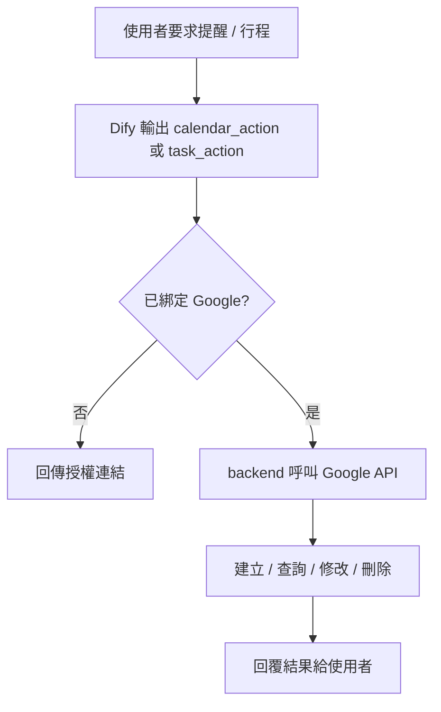

# lineagent

一個以 LINE 為入口的個人助理型 agent。

這個專案的重點不是做一個只能聊天的 bot，而是做一個能把「自然語言理解」和「後端執行」清楚分離的助理系統：

- 使用者在 LINE 直接輸入需求
- `Dify` 作為大腦，負責理解意圖、分類任務、判斷是否需要上下文、決定是否要觸發後端動作
- `Python backend` 作為執行器，負責真的去執行 Google、記憶、檔案輸出、語音與圖片處理

## 專案特色

### 1. Dify 是大腦，backend 是執行器

本專案刻意避免把後端寫成龐大的 NLP parser。

整體設計是：

- `Dify`
  - 理解自然語言
  - 區分新任務 / 舊任務續接 / 閒聊
  - 判斷是否要建立提醒、查 Google 行程、寫入記憶、輸出檔案
  - 輸出固定 JSON contract
- `backend`
  - 驗證 contract
  - 執行 Google Calendar / Google Tasks / SQLite / 檔案生成
  - 做少量安全 guardrail
  - 提供 user-safe fallback

這讓系統可以逐步優化大腦，而不必把每個自然語言規則都硬寫在後端。

### 2. Contract-first 架構

Dify 不直接控制程式，而是輸出固定結構化欄位，再由 backend 執行。

目前核心欄位包括：

- `conversation_mode`
- `context_usage`
- `calendar_action`
- `task_action`
- `memory_actions`
- `profile_updates`
- `account_updates`
- `requested_outputs`

這個設計的好處是：

- Dify prompt 可以獨立優化
- backend 邏輯更穩定
- 可做固定驗收題庫
- 真實錯誤可逐步回灌

### 3. 可控的長期個人記憶

本專案不是把所有對話都丟給模型記住，而是用本地 SQLite 建立可控記憶層。

目前記憶分成：

- `conversation_history`
  - 短期對話上下文
- `user_profiles`
  - 常用 email、出發地、人數、地址等穩定偏好
- `connected_accounts`
  - Google 或其他服務帳號識別
- `artifacts / image_assets / pending_approvals`
  - 任務產物、圖片索引、待確認流程

也就是說，模型決定「要不要記」，但真正的資料是由 backend 存進本地資料庫。

### 4. Google 助理能力

目前已經聚焦在可實際使用的個人助理能力：

- Google Calendar
  - 建立行程
  - 查詢行程
  - 修改行程
  - 刪除 / 取消行程
- Google Tasks
  - 建立提醒
  - 查詢提醒
  - 修改提醒
  - 完成提醒
  - 刪除提醒

這讓它不只是會「告訴你怎麼做」，而是真的能幫你把提醒或行程建立進你的 Google 系統。

### 5. 多模態輸入

目前支援：

- 文字
- 語音
- 圖片

語音會先經過：

- LINE 音訊下載
- AssemblyAI 轉錄
- 語者分離（speaker diarization）

圖片則會先經過：

- LINE 圖片下載
- 本地短期快取
- 上傳 Dify vision 分析

所以同一個助理架構，可以處理文字、語音與圖片三種主要輸入型態。

### 6. 檔案輸出

除了文字回覆之外，系統也能把結果產生為：

- `txt`
- `docx`
- `pdf`

適合拿來做：

- 會議重點整理
- 報告摘要
- 行程表
- 結構化說明文件

### 7. 真實系統導向的錯誤處理

這個專案的設計目標不是把錯誤原文丟給使用者，而是：

- user 看到安全訊息
- 後台 log 留下完整 trace
- 管理者可收到異常通知

這讓系統比較接近真正可維運的 assistant，而不是單純 demo bot。

## 整體架構

## 整體流程圖

## 核心資料流

### 1. 文字任務流程

### 2. 語音流程

### 3. 圖片流程

### 4. Google 助理流程

## 專案核心模組

### `bot.py`

LINE webhook 入口，負責：

- 接收訊息
- 區分文字 / 音訊 / 圖片 / 檔案 / 位置
- 立即 ACK
- 把重工作交給 runtime

### `secretary_agent/runtime.py`

整個系統的執行核心，負責：

- task 建立與排程
- Dify planner 呼叫
- contract 驗證
- Google / memory / artifact / image / audio 執行
- 最終回覆與錯誤處理

### `secretary_agent/dify_client.py`

負責和 Dify 溝通：

- 傳送使用者最新目標與 runtime context
- 接收結構化 JSON
- 上傳圖片到 Dify files endpoint

### `secretary_agent/memory.py`

負責本地記憶與持久化：

- conversation history
- user profile
- connected accounts
- task runs / task steps
- artifacts / image assets / pending approvals

### `secretary_agent/google_workspace.py`

Google Calendar / Google Tasks 整合層。

### `secretary_agent/audio_transcriber.py`

語音轉文字與 speaker diarization。

### `secretary_agent/image_storage.py`

圖片快取與清理。

### `secretary_agent/artifact_generator.py`

文字、Word、PDF 輸出。

## 設計特色總結

這個專案的特色不在於「做很多功能」，而在於它的架構選擇：

- 用 `LINE` 做使用者介面
- 用 `Dify` 當主要大腦
- 用 `Python backend` 做執行器
- 用 `SQLite` 做可控記憶
- 用固定 JSON contract 把理解與執行分開

所以它不是一個單純的 bot，而是一個正在往「真正可用的助理系統」演進的基礎架構。
