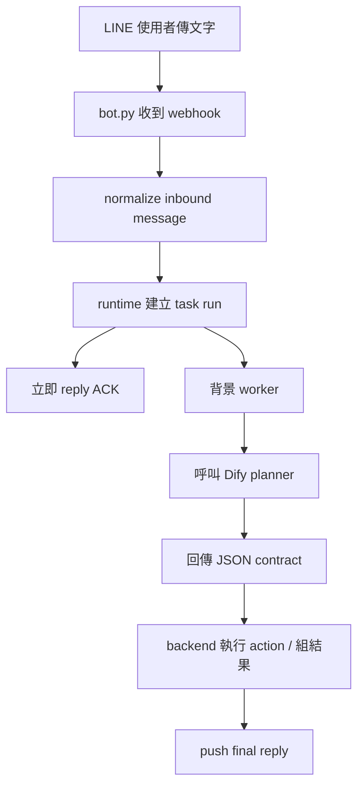
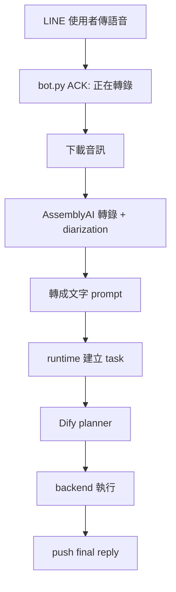
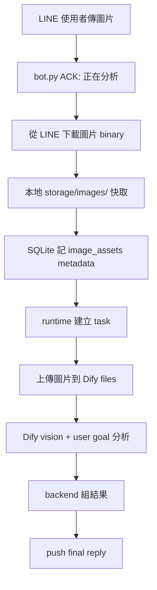
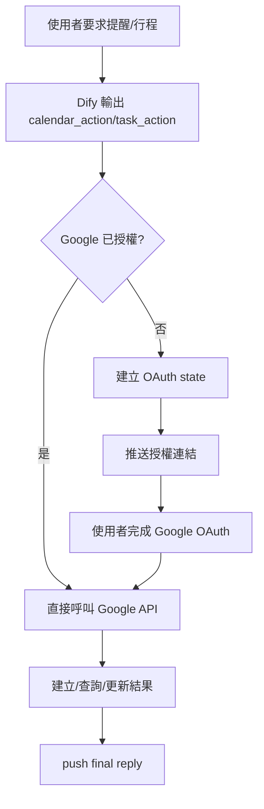

# lineagent

一個以 LINE 為入口的個人助理型 agent。  
目前這個專案的核心目標不是做一個單純聊天機器人，而是做一個：

- 能理解自然語言目標
- 能維持有限但可控的個人記憶
- 能建立與查詢 Google Calendar / Google Tasks
- 能處理語音、圖片、一般文字
- 能把分析結果輸出成檔案
- 能把 AI 理解和後端執行分離

整體架構採用：

- `Dify`：大腦，負責理解、分類、判斷、追問、產出結構化 JSON contract
- `Python backend`：執行器，負責 LINE webhook、SQLite、Google API、檔案生成、圖片/語音暫存與清理
- `LINE`：主要使用者介面

## 1. 專案目的

這個專案要解的不是「讓 AI 能回話」，而是讓它逐步成為一個可用的助理系統。

目前已聚焦在以下幾類能力：

- 個人助理
  - 建立提醒事項
  - 建立 / 查詢 / 修改 / 刪除 Google 行程
  - 建立 / 查詢 / 修改 / 完成 / 刪除 Google Tasks
- 長期個人記憶
  - 記住常用 email、出發地、人數、地址、帳號識別
  - 後續任務可重用這些資料
- 多模態輸入
  - 文字
  - 語音
  - 圖片
- 分析輸出
  - 純文字回覆
  - `txt`
  - `docx`
  - `pdf`

刻意暫不做：

- 全自動網站操作
- 加入購物車 / 訂票 / 訂房到付款前
- 自動付款
- 文件上傳後的 PDF / DOCX 內容分析

## 2. 架構原則

### 2.1 Dify 是大腦，backend 是執行器

本專案刻意避免把後端寫成一個越來越大的 NLP parser。  
自然語言理解應該主要由 Dify 完成，後端只做：

- schema validation
- execution guardrail
- backend action execution
- user-safe fallback

也就是：

- Dify 負責回答：「這句話是什麼意圖？要不要用上下文？要不要執行 Google / 記憶 / 檔案輸出？」
- backend 負責回答：「既然你決定要做，那我幫你真的去做」

### 2.2 Contract-first

Dify 不直接驅動程式碼。  
它只輸出固定 JSON contract，後端只相信結構化欄位。

例如：

- `calendar_action`
- `task_action`
- `memory_actions`
- `profile_updates`
- `account_updates`
- `requested_outputs`

這樣的好處：

- prompt 可以逐步優化
- 後端執行邏輯穩定
- regression 容易測
- 真實錯誤可以回灌成題庫

### 2.3 小步迭代，不靠大量人工測

優化策略是：

1. 固定驗收題庫
2. 真實錯誤回灌
3. 小步 contract 優化
4. 後端只保留少量 deterministic guardrail

## 3. 專案結構

```text
lineagent/
├── bot.py
├── run_agentbot.sh
├── .env.bot.example
├── README.md
├── dify/
│   ├── README.md
│   └── SYSTEM_PROMPT.md
├── secretary_agent/
│   ├── admin_notifier.py
│   ├── artifact_generator.py
│   ├── audio_transcriber.py
│   ├── config.py
│   ├── dify_client.py
│   ├── google_workspace.py
│   ├── image_storage.py
│   ├── logging_utils.py
│   ├── memory.py
│   ├── models.py
│   ├── runtime.py
│   ├── transport_line.py
│   └── utils.py
├── scripts/
│   └── run_golden_set.py
├── tests/
│   ├── golden_set.json
│   ├── test_dify_client.py
│   ├── test_golden_set.py
│   └── test_secretary_runtime.py
├── storage/
│   └── images/
├── output/
│   └── doc/
└── logs/
```

## 4. 核心模組

### 4.1 `bot.py`

Flask + LINE webhook 入口。

職責：

- 接收 LINE 訊息
- 分流文字 / 圖片 / 音訊 / 檔案 / 位置
- 立即 ACK
- 把實際工作丟給 runtime

### 4.2 `secretary_agent/runtime.py`

整個後端執行核心。

職責：

- 建立 task run
- 背景 worker 處理 queue
- 呼叫 Dify planner
- 驗證 planner contract
- 執行 Google / memory / artifact / image upload
- push final result
- user-safe error handling

### 4.3 `secretary_agent/dify_client.py`

Dify API client。

職責：

- 呼叫 chat planner
- 解析 Dify 回傳的 JSON
- 上傳圖片檔到 Dify files endpoint

重要設計：

- Dify `INSTRUCTION` 是唯一 prompt source of truth
- 本地不再把完整 system prompt 注入 query
- 本地只傳：
  - 使用者最新目標
  - runtime context

### 4.4 `secretary_agent/memory.py`

SQLite persistence layer。

負責：

- 對話歷史
- task runs
- task steps
- artifacts
- user profile
- connected accounts
- pending approvals
- image asset metadata

### 4.5 `secretary_agent/google_workspace.py`

Google Calendar / Tasks integration。

目前支援：

- Google OAuth
- create / update / cancel / list calendar event
- create / update / complete / delete / list task

### 4.6 `secretary_agent/audio_transcriber.py`

語音轉文字。

目前使用：

- AssemblyAI
- speaker diarization

### 4.7 `secretary_agent/image_storage.py`

圖片暫存與清理。

設計原則：

- 圖片 binary 不進 SQLite
- 只落地到本地磁碟
- SQLite 只存 metadata
- 預設保留 7 天

### 4.8 `secretary_agent/artifact_generator.py`

輸出檔案生成器。

目前支援：

- `txt`
- `docx`
- `pdf`

## 5. 資料流

### 5.1 文字訊息



### 5.2 語音訊息



### 5.3 圖片訊息



### 5.4 Google 助理流程



## 6. Dify contract 設計

目前重點欄位：

- `conversation_mode`
  - `new_task`
  - `continue_task`
  - `casual_reply`
- `context_usage`
  - `none`
  - `recent_task`
  - `pending_approval`
  - `quoted_message`
- `task_type`
  - `information_request`
  - `research_and_compare`
  - `trip_planning`
  - `action_prep`
- `calendar_action`
- `task_action`
- `memory_actions`
- `profile_updates`
- `account_updates`
- `requested_outputs`
- `document_title`

重要原則：

- Dify 只負責判斷與輸出 contract
- `final_reply` 不會直接觸發 backend action
- 所有未使用 execution field 必須為空
- 旅遊「行程」不等於 Google Calendar event
- casual reply 不得續接舊任務

## 7. 長期記憶設計

目前是本地 SQLite 長期記憶，不依賴 Dify 自己保存。

分成三類：

1. `profile`
- 常用 email
- 常用出發地
- 人數
- 地址
- 偏好

2. `connected_accounts`
- Google
- 其他帳號識別

3. `conversation/task context`
- 最近對話
- recent service artifacts
- pending approval

原則：

- 記帳號識別，不記密碼
- 不存信用卡
- 不存 OTP
- 不把一次性任務資訊寫成長期記憶

## 8. 目前已完成功能

### 已完成

- LINE webhook 接入
- Dify contract-first planner 架構
- 文字問答 / 一般研究
- 旅遊規劃
- Google Calendar
- Google Tasks
- 長期個人記憶
- 語音轉文字
- 圖片上傳與 vision 分析
- 檔案輸出
- 管理告警 LINE 通知
- log 按重啟分檔
- golden set regression runner

### 已刻意關閉 / 未開放

- browser automation
- cart / checkout / payment
- PDF / DOCX 文件上傳分析
- 圖片長期知識庫
- 以圖搜圖

## 9. 目前限制

### 9.1 圖片

- 只做短期快取
- 不做永久圖庫
- 不做跨任務圖片檢索

### 9.2 文件

- 目前沒有文件分析
- user 上傳 PDF / DOCX 會被明確告知尚未開放文件分析

### 9.3 Dify planner

- 已經是主大腦，但仍需要少量 backend guardrail
- 不是完全無 fallback 的自由 agent

### 9.4 LINE 配額

- background push 受 LINE 月額度限制
- 超額時 webhook/reply 可能還活著，但 push 會失敗

## 10. 設定

請建立：

- `.env.bot`

至少需要：

```bash
LINE_CHANNEL_ACCESS_TOKEN=...
LINE_CHANNEL_SECRET=...
DIFY_API_KEY=...
```

常用設定還包括：

```bash
DIFY_BASE_URL=https://api.dify.ai/v1
PUBLIC_BASE_URL=https://your-domain
BOT_DB_PATH=/abs/path/to/bot_memory.sqlite3
ARTIFACT_OUTPUT_DIR=/abs/path/to/output/doc
IMAGE_STORAGE_DIR=/abs/path/to/storage/images
IMAGE_RETENTION_DAYS=7
ASSEMBLYAI_API_KEY=...
GOOGLE_CLIENT_ID=...
GOOGLE_CLIENT_SECRET=...
GOOGLE_REDIRECT_URI=https://your-domain/auth/google/callback
ADMIN_ALERT_LINE_USER_ID=Uxxxxxxxx
```

## 11. 啟動方式

```bash
cd /Users/linxuanli/Library/Mobile\ Documents/com~apple~CloudDocs/Code/lineagent
./run_agentbot.sh
```

會啟動：

- Flask bot
- ngrok

log 位置：

- `logs/bot.log`
- `logs/ngrok.log`

每次重啟會自動輪替成：

- `bot_YYYYMMDD_HHMMSS.log`
- `ngrok_YYYYMMDD_HHMMSS.log`

## 12. 測試

### 單元測試

```bash
python3 -m unittest tests.test_dify_client tests.test_secretary_runtime tests.test_golden_set
```

### 語法檢查

```bash
python3 -m py_compile bot.py secretary_agent/*.py tests/test_dify_client.py tests/test_secretary_runtime.py tests/test_golden_set.py
```

### Golden set regression

```bash
python3 scripts/run_golden_set.py
```

輸出會存到：

- `reports/golden_set_report_YYYYMMDD_HHMMSS.json`

## 13. 建議的持續優化方式

這個專案不適合靠「大量人工亂測」來長期維護。  
比較對的方式是：

1. 維護固定題庫
2. 把真實 user 錯誤回灌成測試
3. 小步修 prompt contract
4. 後端只保留最小 guardrail

建議優先順序：

1. 上下文續接穩定
2. Google 行程 / 提醒查詢與修改穩定
3. execution field 不污染
4. 記憶寫入更保守
5. 多模態任務持續穩定

## 14. 後續建議

我認為最值得補上的下一批能力是：

1. 文件分析
- PDF
- DOCX
- 先本地抽文字，再送 Dify

2. 圖片功能完善
- 多張圖片同時分析
- 圖片搭配文字問答
- 更細的圖片錯誤分類

3. 管理維運
- 失敗類型儀表板
- LINE + email 雙通道告警
- 更完整的 golden set scenario runner

4. 記憶系統收斂
- 更細的 profile schema
- 更保守的記憶寫入規則
- 依任務類型選擇性注入記憶

## 15. 一句話總結

這個專案目前是一個：

**以 LINE 為入口、以 Dify 為大腦、以 Python backend 為執行器的個人助理型 agent。**

它已經具備：

- 多模態輸入
- Google 助理能力
- 長期記憶
- 檔案輸出
- regression 測試基礎

但仍處於「可用、可擴充、持續收斂」的工程化階段，而不是最終完成版。
